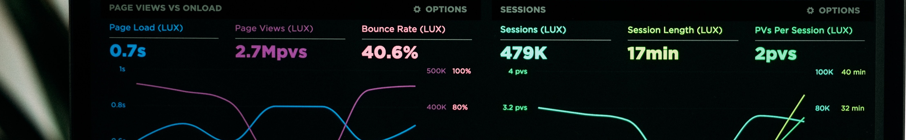

# Course Syllabus

This is the official syllabus and course outline for {{ COURSE_CODE }}.

```{warning} Please note that this syllabus is currently under active development, there may be typos or missing sections; treat this as a draft until the course starts!
```

(grading_practices)=
### How will I be evaluated in this course?

The grading scheme for this course is here:

| Item              | Weight | Due date(s)                |
|-------------------|--------|----------------------------|
| Milestone 1       | 25%    | Thursday March 4 at 18:00  |
| Milestone 2       | 15%    | Thursday March 11 at 18:00 |
| Milestone 3       | 15%    | Thursday March 18 at 18:00 |
| Milestone 4       | 25%    | Thursday March 25 at 18:00 |
| Teamwork Document | 20%    | Thursday March 25 at 18:00 |

```{attention} 
All deadlines in this course have an automatic 48 hour grace period after the due dates listed above.
Any submissions submitted past the grace period will not be graded (with some exceptions).
```

```{include} syllabus_bits/syllabus_01_highlights.md
```

```{include} syllabus_bits/syllabus_02_changelog.md
```

<!-- ```{include} syllabus_bits/syllabus_03_details.md
```

```{include} syllabus_bits/syllabus_04_tools.md
```

```{include} syllabus_bits/syllabus_05_taught.md
```

```{include} syllabus_bits/syllabus_06_doing_well.md
```

```{include} syllabus_bits/syllabus_07_integrity.md
```

```{include} syllabus_bits/syllabus_08_accommodations.md
```

```{include} syllabus_bits/syllabus_09_policies.md
```

```{include} syllabus_bits/syllabus_10_references.md
``` -->