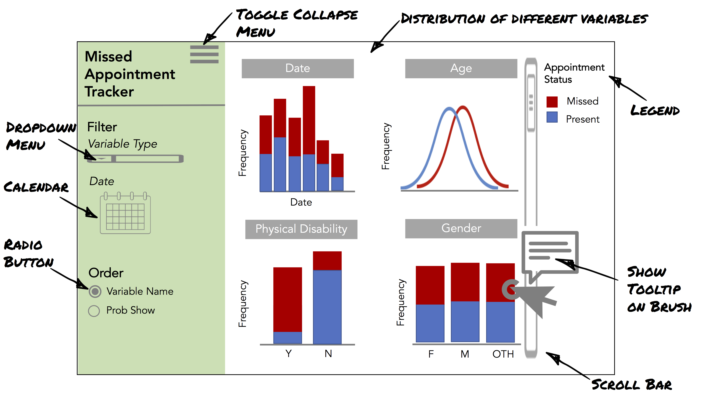

# Project background

DATA 551 is a project-based course where you will be working in a team of 3-4 students
with the goal of designing a dashboard
for interactive data visualization, exploration, and communication.
In addition to principles of effective dashboard development,
this project will allow you to practice concept design,
prototyping and platform evaluation,
as well as creating a final product for a target user.

You will create a scenario for your dashboard,
which includes choosing the target audience (internal research team, public communication, etc),
who you are (part of a company, NGO, research team, student group, etc),
and the goal of building the app for your target audience (communicating your research to the public, deriving market insight, driving end user decision making, etc).
It is OK if this changes slightly as your are building the app,
but try to stay to it as much as possible
so that you have a clear direction throughout.
As a team you will agree on how to work during this project
and formalize it by writing a teamwork contract.

As in a real-world project,
you will then evaluate two different technology stacks
(dash-R with ggploty and dash-Py with Python)
by building a prototype of your dashboard in each.
You will write brief analyze on your experience in each,
including which criteria you used to evaluate them
and why you chose the platform you did.
Another group will take on the hat of your intended target audience,
try using your app and give you feedback on their experience.
You will then incorporate this feedback into one last round of improvements
to finalize your product.

This process will be spread out over four milestones:

1. Pick scenario, dataset, and target audience. Write teamworking contract and sketch dashboard.
2. Create and deploy dashboard prototype in Python.
3. Create and deploy dashboard prototype in R. Give and receive feedback on another group's milestone 2.
4. Pick a technology stack from M3/4 and motivate your choice.
   Implement the feedback from M3 and make final improvements to the dashboard to be production ready.

The projects will be developed on GitHub.com in public repos, contrary to the private repos we have been working in so far.

# Milestone 1 - Dashboard proposal

In this milestone, you will set-up your project for development and submit a dashboard proposal.

## 1. Submission Instructions
rubric={mechanics:4}

- [Click here to view a description of the rubrics used to grade the questions](https://github.com/UBC-MDS/public/tree/master/rubric).
- In the [UBCO-MDS GitHub organization](https://github.com/ubco-mds-2020-labs) on github.com, set-up a public repository with a reasonable name for your project.
    - We need a public github.com repo for deployment. This will also make it easy to share a link to your work as part of your portfolio.
    - This also keeps milestone requirements separate from your actual code-base. You will be making Github releases of your own repository rather than committing to the milestone repository.
- Pick a suitable licence. MIT and BSD-3 are common good options for open source projects. [The carpentries has a short primer on licenses](http://swcarpentry.github.io/git-novice/11-licensing/index.html) (optional read).

### Canvas submission

- Once you have finished the write up of the dashboard proposal and the team-working documents,
  **you must create a release on GitHub.com before the submission deadline.**
    - Please [read the GitHub documentation on how to create a release via the online interface]( https://docs.github.com/en/free-pro-team@latest/github/administering-a-repository/releasing-projects-on-github). Name your release with the respective milestone name.
    - We will grade all files in the repo at the state they were in when you created the release.
      This means that you can continue to make changes in the repo without worrying about messing up your grading for the previous milestone.

### Tips for working collaboratively on GitHub

- Every time you work on the project, you should first pull the upstream changes.
- Try to commit to git often when you work on this project.
    - If you are working together synchronously
      and a team-member has already approved your changes,
      you can commit directly to the main branch.
      Otherwise, create a pull-request and request a review from a teammate.
    - You can either work on different branches directly in the repo you created,
      or fork the repo and work on a branch in your own fork.
- Use GitHub issues to track features that you are planning to implement
  and bugs in the app.

## 2. Proposal

Your proposal should be no more than 1,000 words and include a sketch of your app.
The proposal should be written as a markdown document (`proposal.md`) in your GitHub.com repo
and include the following sections:

1. Motivation and purpose
3. Description of the data
4. Research questions you are exploring

You will be assessed on the reasoning underlying your proposal
as well as the quality and clarity of your writing.

Each of the proposal sections are described below and include an example of what is expected. You don't have to write your own proposal _exactly_ the same as the examples, they just serve as inspiration.
You will not be penalized if you can't implement everything in your proposal,
or if your app changes due to technical or time limitations,
but try to think about whether you think you will be able to implement it
in the time frame of the course
(this is admittedly hard since you have not worked with the dashboard frameworks before,
but it is good to have it in mind already in the planning phase).

### Section 1: Motivation and Purpose
rubric={reasoning:8,writing:2}

In a few sentences, provide motivation for why you are creating a dashboard.
Who is your target audience, and what role are you embodying?
What problem could your dashboard solve for the intended user?
You can read the [Project background](#project-background) section for some rough ideas.
Be brief and clear.

Example writeup:

> Our role: Data scientist consultancy firm
>
> Target audience: Health care administrators
>
> Missed medical appointments cost the healthcare system a lot of money and affects the quality of care. If we could understand what factors lead to missed appointments it may be possible to reduce their frequency. To address this challenge, we propose building a data visualization app that allows health care administrators to visually explore a dataset of missed appointments to identify common factors. Our app will show the distribution of factors contributing to appointment show/no show and allow users to explore different aspects of this data by filtering and re-ordering on different variables in order to compare factors that contribute to absence.

### Section 2: Description of the data
rubric={reasoning:8,writing:2}

You must use one of the datasets that was previously approved in Data 550 for this project,
as long as you have the license to use it publicly.
Now that you have some more experience with the data, you can start diving deeper into the dataset and update things with an eye for the dashboard.

In your proposal,
briefly describe the dataset and the variables that you will visualize.
If you are planning to visualize a lot of columns,
provide a high level descriptor of the variable types rather than listing every single column.
For example,
indicate that the dataset contains a variety of categorical variables for demographics and provide a brief list rather than describing every single variable.
You may also want to consider visualizing a smaller set of variables given the short duration of this project.
This might include brief exploratory data analysis
for you to grasp what could be interesting aspects to look at in your data.
We will not be grading the EDA aspect,
but feel free to include your EDA notebooks in the public GitHub repo,
so that you have everything in one place.

Example writeup:

> We will be visualizing a dataset of approximately 300,000 missed patient appointments.
> Each appointment has 15 associated variables
> that describe the patient who made the appointment
> (`patient_id`, `gender`, `age`),
> the health status (`health_status`) of the patient
> (Hypertension, Diabetes, Alcohol intake, physical disabilities),
> information about the appointment itself (`appointment_id`, `appointment_date`),
> whether the patient showed up (`status`),
> and if a text message was sent to the patient about the appointment (`sms_sent`).
> Using this data we will also derive a new variable,
> which is the predicted probability that a patient will show up for their appointment (`prob_show`).

Remember if your dataset has _a lot_ of columns,
stick to summaries and avoid listing out every single column.
The example also differentiates columns that come with the dataset (i.e.
`Age`) from new variables that you might derive for your visualizations (i.e `ProbShow`) - you should make a similar distinction in your write-up if you can.
Another example of [a good description of a dataset is the Kaggle world happiness report](https://www.kaggle.com/unsdsn/world-happiness).

### Section 3: Research questions and usage scenarios
rubric={reasoning:12,writing:2}

The purpose of this section is to get you to think about
how your target audience might use the app you're to designing
and to account for those needs in the proposal.

For this it can be helpful to create a [brief persona description](https://mozilla.github.io/open-leadership-training-series/articles/building-communities-of-contributors/bring-on-contributors-using-personas-and-pathways/#personas) of a member in your intended target audience
and write small user story for what they might do with your app.
User stories are typically written in a narrative style and include the specific context of usage, tasks associated with that use context,
and a hypothetical walkthrough of how the user would accomplish those tasks with your app. 
If you are using a Kaggle dataset,
you may use their "Overview (inspiration)" to create your usage scenario.

An example usage scenario with tasks (tasks are indicated in brackets, i.e. [task], and are optional to include)

> Mary is a policy maker with the Canadian Ministry of Health
and she wants to understand what factors lead to missed appointments
in order to devise an intervention that improves attendance numbers.
She wants to be able to [explore] a dataset
in order to [compare] the effect of different variables on absenteeism
and [identify] the most relevant variables around
which to frame her intervention policy.
When Mary logs on to the "Missed Appointments app",
she will see an overview of all the available variables in her dataset,
according to the number of people that did or did not show up to their medical appointment.
She can filter out variables for head-to-head comparisons,
and/or rank patients according to their predicted probability of missing an appointment.
When she does so,
Mary may notice that "physical disability"
appears to be a strong predictor missing appointments,
and in fact patients with a physical disability
also have the largest number of missed appointments.
She hypothesizes that patients with a physical disability
could be having a hard time finding transportation to their appointments,
and decides she needs to conduct a follow-on study
since transportation information is not captured in her current dataset.

Note that in the above example,
"physical disability" being an important variable is fictional.
You don't need to conduct an analysis of your data to figure out what is important or not.
Instead,
estimate what someone might find,
and how they may use this information.

## 3. Description of your app & sketch
rubric={viz:10}

Building from your research questions and usage scenarios,
give a high-level description of the interface for the app you will build.
Remember to be realistic about your expectations and plans since you will actually be implementing this app
(but again, you will not be penalized if you need to adjust a bit in later milestones).
It is better to design a slightly more limited app
that you have time to implement well,
instead of a complicated app that you don't have time to finish.
At the same time,
you cannot just make a single barchart and call it a day.
The app needs to have a few plot panels,
use the visualizations from previous students shown in lecture one as a guide
as a complexity target for the final app.

In this description you are not required to use terminology specific to Dash apps
(i.e. widgets, components, etc...) or make reference to specific Python or R libraries.
Your sketch can be hand-drawn or mocked up using a graphics editor.
If you can show the app visual design & interaction design in a single image that is ideal,
but if you need more space to show some other planned features of your app
you can include max three images for this proposal.

The description should be about 200-300 words and live in the `README.md` file of your GitHub.com repository.
The sketch should be linked in the `README.md`
file of your GitHub.com repository underneath the high level description
so that the image shows up on GitHub.

Example description

> The app contains a landing page that shows the distribution
(depending on data type, bar chart, density chart etc)
of dataset factors (hypertension, physical disabilities etc.)
colored coded according to whether patients showed up or didn't show up for an appointment.
From a dropdown list,
users can filter out variables from the distribution display,
by patient demographics (i.e. only show female patients),
by appointment data (i.e. if SMS was sent),
and finally by the date range of appointments.
A different dropdown menu will allow users to re-order variables
according to the probability of patients being a no-show
or in alphabetical order to comorbidities.
Users can compare the distribution of co-morbidities
by scrolling down through the app interface.

Example sketch

This sketch was drawn using Powerpoint
with icons from the [noun project](https://thenounproject.com/).
You can use others graphics tools
(i.e. Inkscape, GIMP, Photoshop, Illustrator, etc.)
or you can even draw you app by hand and upload the scanned version of your drawing.
Whatever you choose to do,
make sure that the final image in your report is legible.

## 4. Team work contract and collaborative documentation

### Team work contract
rubric={reasoning:4}

A team work contract communicates specifically **how** the core group of people who are working together
and gives more detail about the logisitics of working together and the expectations you have for each other.
This document will govern your working relationship and if done correctly,
should help you manage and resolve any issues that arise.
MIT's online software construction course has [a good description of what to put in a team work contract](http://web.mit.edu/6.005/www/fa15/projects/abcplayer/team-contract/).
Some key aspects of the team work contract could be:

- How will work be distributed in a fair and equitable way?
- What are the expected work hours for the project? 
- How often will group meetings occur ([here is a nice article](http://third-bit.com/2018/05/11/meetings.html) on meetings)?
- Will you have meeting agendas and minutes? If so, what will be the system for rotating through these responsibilities?
- What will be the style of working?
    - Will you start each day with [stand-ups](https://www.atlassian.com/agile/scrum/standups), or submit a summary of your contributions 4 hours before each meeting? or something else?
- What is the quality of work each team member expects from themselves and each other?
- When are team members not available (e.g., evenings and Sundays because of family obligations).
- And any other similar things that govern your working relationships.

Use this opportunity to use your prior knowledge/experience to improve your teamwork, communication, leadership, and organizational skills.
You will need all of these for your capstone projects (and beyond)!

#### Activity for building a team work contract

We recommend that generate the team work contract according to these guidelines

- For 5 minutes, each team member will silently write out 4 different suggestions for the team work contract on their computer.
- Next, paste all suggestions into a common Google doc (or similar)
  and arrange them to put similar suggestions together.
- Spend 10 -15 minutes discussing the suggestions
  and decide which ones you will use for your team contract either by consensus or voting
  (you can of course add new ones at this point if any were missed earlier)
- Add the final contract in a file called `team-contract.md` in the repo root
  (in organizations this file might be kept internal instead of committed to a public repo).
    - These are the principles you adhere to when working.
    - This file should only be updated if there is agreement between team members to do so.

### Code of Conduct
rubric={reasoning:1}

In an attempt to create a safe, positive, productive, and happy community,
many organizations and developers create a code of conduct for their projects,
which is typically documented in a file called `CODE_OF_CONDUCT.md` in the project root.
A code of conduct in a Data Science project
informs others of social norms, acceptable behaviour and general etiquette.
It is more outward facing than the team work contract discussed above.
We recommend [Project Include](https://projectinclude.org/writing_cocs)
and [Mozilla Open Leaders](https://mozilla.github.io/open-leadership-training-series/articles/building-communities-of-contributors/write-a-code-of-conduct/)
for a comprehensive guides to writing an effective Code of Conduct (both optional reads).

We believe that an effective code of conduct should include:

- A statement on inclusivity and harassment free involvement in the project.
- Details on expected behaviour and unacceptable behavior.
- A procedure for reporting unacceptable behaviour.

Sample Codes of Conduct:

  - [Contributor Covenant](https://www.contributor-covenant.org/version/1/4/code-of-conduct/)
  - [UBC Data Science 100 CoC](https://github.com/UBC-DSCI/dsci-100/blob/master/CODE_OF_CONDUCT.md)
  - [Python Community CoC](https://www.python.org/psf/conduct/)
  - [Tidyverse CoC](https://github.com/tidyverse/tidyverse.org/blob/master/CODE_OF_CONDUCT.md)
  - [Pandas CoC](https://github.com/pandas-dev/pandas-governance/blob/master/code-of-conduct.md)

### Contribution guidelines
rubric={reasoning:1}

- It is a good practice to include information
  about how others can contribute to your project somewhere in your repository,
  which is typically done in a file called `CONTRIBUTING.md` in the project root.
- You can read more in the [Mozilla Open Leaders training program](https://mozilla.github.io/open-leadership-training-series/articles/building-communities-of-contributors/write-contributor-guidelines/),
  get inspiration from other open source projects such as [pandas](https://github.com/pandas-dev/pandas/blob/master/.github/CONTRIBUTING.md)
  or the [mozilla leadership training](https://github.com/mozilla/open-leadership-training-series/blob/gh-pages/CONTRIBUTING.md),
  or use this simple template:
    - > We welcome all contributions to this project! If you notice a bug or have a feature request, please [open up an issue](<insert link to your GH issue tracker). All contributors must abide by our [code of conduct](<insert link to CoC file).

## 5. Start developing your app (Optional)
rubric={accuracy:2}

It is recommended to take the first steps in the app development already
and push your code to GitHub.
This can be very basic,
like the foundations of the app layout
with a few core dash components
and maybe a plot even if they are not yet linked together.
This will make sure you can hit the ground running
for the next milestone and don't have to deal with any setup issues.
